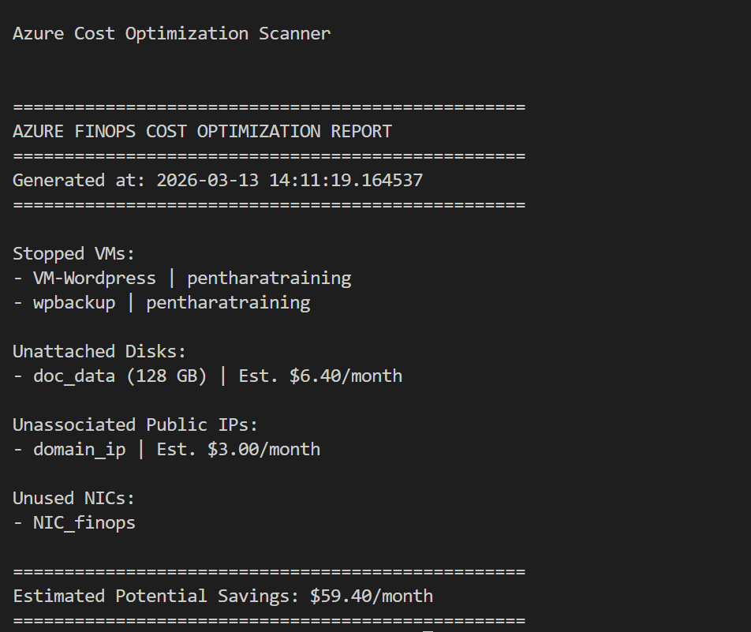

# Azure Cost Optimization Scanner

## 📌 Overview
The **Azure Cost Optimization Scanner** is a Python script that detects unused or idle Azure resources (stopped VMs, unattached disks, unused IPs, orphaned NICs) and estimates potential monthly savings. It generates a simple, human‑readable report to highlight cost optimization opportunities.

## 🔑 Features
- Finds **stopped/idle VMs** that still incur storage costs.
- Detects **unattached disks** and estimates their monthly cost.
- Identifies **unassociated public IPs** that add unnecessary charges.
- Lists **unused NICs** (no direct cost, but clutter).
- Generates a **summary report** with estimated monthly savings.

## SCRIPT OUTPUT SCREENSHOT


## ⚙️ Dependencies
Make sure you have the following installed:

- [Python 3.8+](https://www.python.org/downloads/)
- [Azure CLI](https://learn.microsoft.com/en-us/cli/azure/install-azure-cli?view=azure-cli-latest)
- **Azure SDKs for Python**:
```bash
pip install azure-identity azure-mgmt-compute azure-mgmt-network azure-mgmt-resourcegraph azure-mgmt-costmanagement
```
or 
```bash
#after cloning the repo
pip install -r requirements.txt
```
--- 

#  Installation Guide

## Step 1: Login to Azure
```bash
az login
```
- Copy the Subscription ID you want to use.

## Step 2: Paste Subscription ID into the Script
```python
# Replace with your Azure Subscription ID
subscription_id = "YOUR_SUBSCRIPTION_ID"
```
## Step 3: Run the Script
```bash
python AZ_SCRIPT.PY
```
